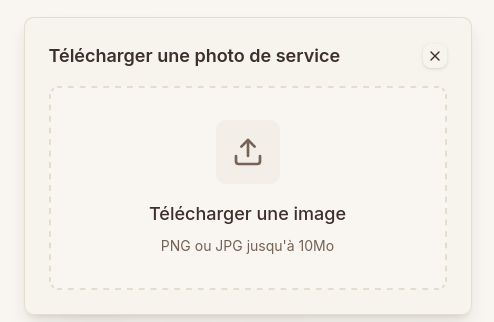

# Ajouter une image à une offre de service

Pour illustrer votre offre et attirer plus de clients, vous pouvez ajouter des photos de vos services.

---

### Étapes pour ajouter une photo

1.  **Cliquer sur le bouton d'ajout**
    Dans le formulaire de création ou de modification d'une offre, repérez le bouton **Ajouter une photo**.

    

2.  **Transférer ou glisser l'image**
    Une zone de téléchargement s'affiche. Vous pouvez soit cliquer dessus pour choisir un fichier, soit faire glisser une image directement dans la zone.

    

3.  **Sélectionner le fichier**
    Si vous avez cliqué sur la zone, l'explorateur de fichiers de votre appareil s'ouvre pour vous permettre de choisir l'image souhaitée.

    

4.  **Recadrer l'image**
    Une fois l'image sélectionnée, un écran de recadrage s'affiche. Ajustez le cadre pour mettre en valeur l'élément principal de votre photo, puis cliquez sur **Recadrer**.

    

5.  **Visualiser le résultat**
    Votre photo apparaît maintenant dans le formulaire de l'offre de service.

    

---

### Limitations et gestion des photos

#### Limite de photos atteinte

Chaque offre de service a un nombre maximum de photos autorisées (selon votre plan). Lorsque cette limite est atteinte, vous ne pouvez plus ajouter de nouvelle photo.

> [!TIP]
> Si vous souhaitez ajouter une nouvelle photo alors que la limite est atteinte, vous devez d'abord supprimer l'une des photos existantes.

#### Indicateur de photos restantes

À droite de la zone des photos, vous trouverez une boîte avec une bordure en pointillés indiquant le nombre de photos déjà ajoutées ou le nombre de places restantes (par exemple `1 / 4`).

_(L'indicateur est visible à côté des photos ajoutées)_
