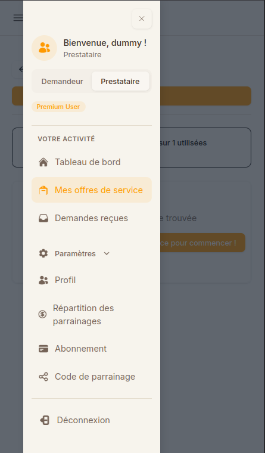
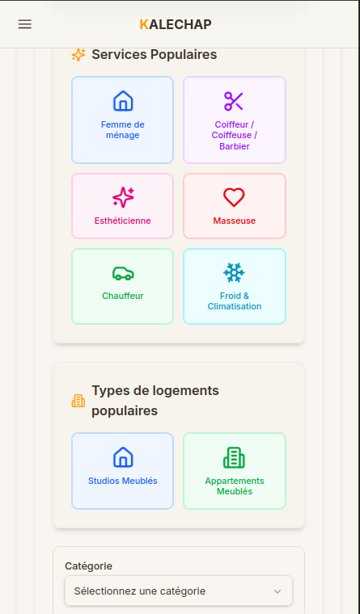
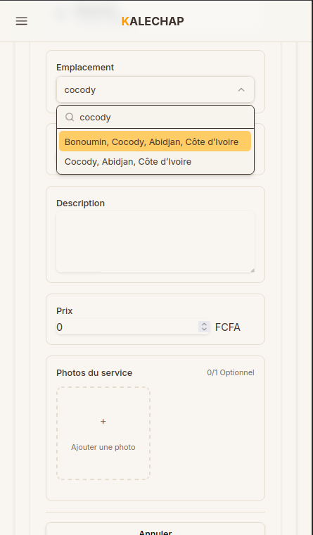

# Ajouter une offre de service

Suivez ce guide pour publier votre première offre de service sur Kalechap.

---

### 1. Ouvrir le menu

Appuyez sur le bouton de menu (hamburger) en haut à gauche de votre écran.

### 2. Accéder à l'espace Prestataire

Sélectionnez l'onglet **Prestataire** en haut du menu.

> [!IMPORTANT]
> L'onglet **Prestataire** n'est accessible qu'aux utilisateurs disposant d'un **abonnement actif** (Gratuit, Standard, Pro ou VIP).

### 3. Mes offres de service

Dans le menu Prestataire, cliquez sur **Mes offres de service**.

### 4. Cliquer sur Ajouter

Sur l'écran qui s'affiche, appuyez sur le bouton **Ajouter** (ou sur le bouton orange "Créez votre première offre de service pour commencer").

### 5. Choisir la catégorie

Sélectionnez la catégorie qui correspond le mieux à votre service (par exemple : Coiffeur, Chauffeur, Femme de ménage, etc.).

### 6. Définir l'emplacement

Précisez le quartier ou la commune où vous proposez vos services.

### 7. Saisir les détails et valider

Remplissez les informations finales :

- **Nom du service**
- **Description** détaillée
- **Prix**
- [**Photo**](ajouter-image-offre-service.md) (optionnel mais recommandé pour attirer les clients)

Enfin, appuyez sur le bouton **Ajouter une offre de service** pour publier votre annonce.

---

## Gérer vos offres de service

Une fois votre offre publiée, vous pouvez la gérer depuis **Mes offres de service** :

### Modifier une offre

1. Dans **Mes offres de service**, repérez l'offre que vous souhaitez modifier
2. Appuyez sur le bouton **Modifier** (icône crayon)
3. Mettez à jour les informations (nom, description, prix, photo)
4. Appuyez sur **Sauvegarder**

### Désactiver / réactiver une offre

Vous pouvez désactiver temporairement une offre sans la supprimer :
1. Appuyez sur l'icône de pause ou d'arrêt sur la carte de l'offre
2. L'offre n'apparaît plus dans les résultats de recherche
3. Pour la réactiver, appuyez à nouveau sur le même bouton

### Supprimer une offre

1. Appuyez sur le bouton **Supprimer** (icône poubelle)
2. Confirmez la suppression
3. L'offre est définitivement retirée

---

## Recevoir et gérer les demandes de clients

Quand un client envoie une demande pour l'un de vos services, vous recevez une notification dans l'application.

Pour voir et répondre aux demandes :
1. Dans le menu **Prestataire**, cliquez sur **Demandes reçues**
2. Consultez les détails de chaque demande
3. **Acceptez** ou **Refusez** la demande
4. Une fois le service effectué, marquez-le comme **Terminé**

➡️ Guide complet : [Gérer les demandes reçues](demandes-recues.md)

---

## Évaluations de vos services

Après qu'un client a marqué votre service comme terminé, il peut laisser une **note** (1 à 5 étoiles) et un **avis écrit**.

Ces évaluations sont visibles sur votre fiche de service et influencent votre visibilité dans les recherches.

➡️ Guide complet : [Évaluations et avis](evaluations.md)

---

## Cas particuliers et limitations

Certaines limitations peuvent empêcher l’ajout immédiat d’une nouvelle offre. Pour plus de détails sur la gestion du nombre d'offres autorisées par votre plan, consultez la page : [Nombre d'offres de service](nombre-offres-service.md).

  <a href="../evaluations/" class="page-nav-item page-nav-item--prev">
    ← Page précédente
    Évaluations et avis
  </a>
  <a href="../demandes-recues/" class="page-nav-item page-nav-item--next">
    Page suivante →
    Gérer les demandes reçues
  </a>

