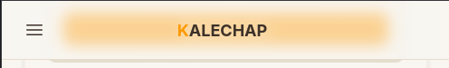
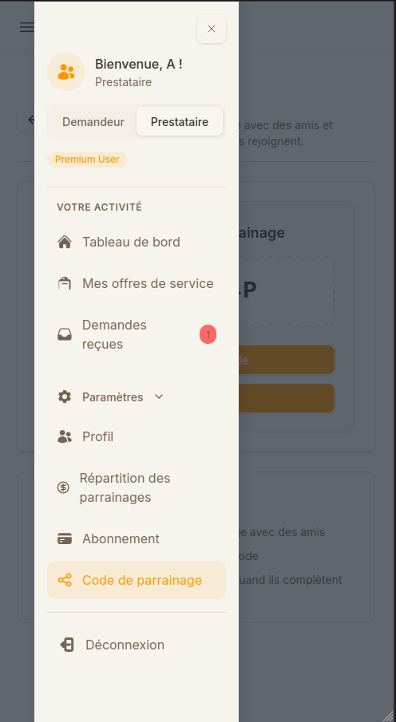
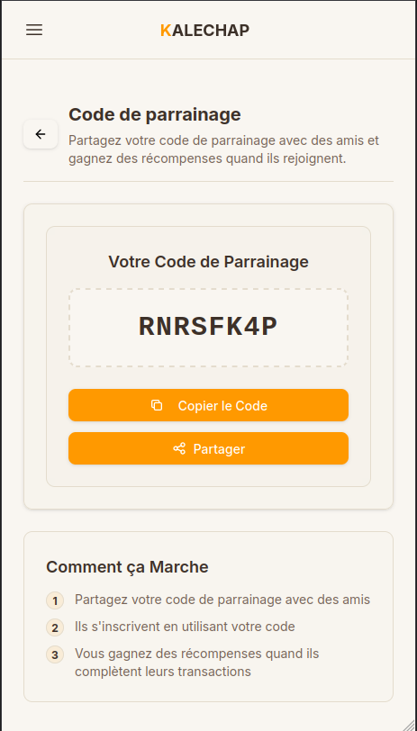

# Code de parrainage

Découvrez comment trouver et partager votre code de parrainage pour gagner des récompenses sur Kalechap.

---

### 1. Ouvrir le menu

Appuyez sur le bouton de menu (hamburger) en haut à gauche de votre écran.

### 2. Accéder au code de parrainage

Dans le menu latéral, cliquez sur le lien **Code de parrainage**.

### 3. Votre code et son fonctionnement

Vous arrivez sur la page de parrainage où vous pouvez voir votre code unique.

- **Partager votre code** : Utilisez le bouton **Partager** ou **Copier le Code** pour l'envoyer à vos amis.
- **Gagner des récompenses** : Lorsqu'un ami s'inscrit avec votre code et complète ses transactions, vous gagnez des récompenses.

---

## 4. Statistiques de parrainage

Dans votre tableau de bord, vous pouvez accéder à **Détails du parrainage** pour voir vos statistiques :

- Nombre de personnes inscrites avec votre code
- Récompenses gagnées
- Évolution dans le temps

Pour y accéder : menu latéral → onglet Demandeur → **Détails du parrainage**

---

## 5. Code de parrainage pour les agences

Si vous êtes inscrit en tant qu'[agence](inscription-agence.md), votre code de parrainage fonctionne dans le cadre du **Réseau de l'agence** :

- Le code est lié à votre structure (et non à votre personne)
- Les récompenses sont attribuées à l'agence
- Le libellé dans l'interface indique spécifiquement "Réseau de l'agence"

> [!NOTE]
> Les agences disposent d'un programme de parrainage adapté à leur activité de placement.

---

## 6. Utiliser le code de parrainage d'un ami

Lors de l'[inscription](inscription.md), vous avez la possibilité de saisir un **code de parrainage** dans le champ prévu à cet effet :

- Le code est optionnel
- Saisissez-le tel qu'il vous a été communiqué (sans espace ni caractère spécial)
- Si vous ne possédez pas de code, laissez le champ vide

  <a href="../nombre-offres-service/" class="page-nav-item page-nav-item--prev">
    ← Page précédente
    Nombre d'offres de service
  </a>
  

