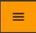
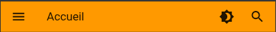

# Bienvenue sur Kalechap

**Kalechap** est une plateforme numérique conçue pour faciliter la **mise en relation entre les prestataires de services et les personnes à la recherche de solutions fiables**, près de chez elles.

Notre objectif est simple :
👉 **rendre visibles les compétences locales** et
👉 **permettre aux utilisateurs de trouver rapidement le bon prestataire**, en toute confiance.

---

## Deux parcours selon votre besoin

Kalechap distingue deux rôles au sein d'un même compte :

| **Demandeur** (vous cherchez un service) | **Prestataire** (vous proposez un service) |
|---|---|
| Recherchez des services près de chez vous | Publiez et gérez vos offres de service |
| Comparez les prestataires et leurs tarifs | Recevez des demandes de clients |
| Envoyez des demandes détaillées | Acceptez ou refusez les demandes |
| Évaluez les services reçus | Soyez évalué par vos clients |

> Vous pouvez être à la fois Demandeur et Prestataire en activant l'onglet **Prestataire** dans le menu. Pour cela, un abonnement est nécessaire (même le plan Gratuit suffit).

---

## Par où commencer ?

👀 **Vous cherchez un service sans créer de compte ?**
Rendez-vous sur la **[page d'accueil de Kalechap](https://kalechap.com)** et utilisez la barre de recherche publique pour explorer les services disponibles près de chez vous.
➡️ Voir le guide : [Page d'accueil (Landing)](landing.md)

📝 **Vous voulez créer un compte pour envoyer des demandes ?**
Suivez le parcours [Inscription](inscription.md) → [Connexion](connexion.md), puis accédez directement à la [Recherche de services](rechercher-service.md).

🏢 **Vous êtes une agence de placement ?**
Découvrez comment vous inscrire en tant qu'agence : [Inscription Agence](inscription-agence.md).

📢 **Vous êtes prestataire et souhaitez publier vos services ?**
Après votre [Inscription](inscription.md) et [Connexion](connexion.md), souscrivez à un [plan d'abonnement](subscription.md) (même gratuit), puis [ajoutez vos offres de service](ajouter-offre.md).

---

## Apprentissage Interactif

Découvrez Kalechap de manière ludique grâce à notre module d'apprentissage interactif !

👉 <a href="./learn/" target="_blank">Ouvrir le mode apprentissage</a>

---

## À quoi sert Kalechap ?

Kalechap permet aux prestataires de services (artisans, professionnels, indépendants, petites entreprises, etc.) de :

- Présenter clairement leurs services
- Être découverts par de nouveaux clients
- Être contactés facilement

Pour les utilisateurs, Kalechap permet de :

- Découvrir des prestataires locaux
- Comparer les services proposés
- Contacter directement les professionnels qui répondent à leurs besoins

---

## Pour qui est Kalechap ?

Kalechap s'adresse principalement :

- Aux **prestataires de services** souhaitant développer leur visibilité
- Aux **particuliers et entreprises** à la recherche de services fiables
- Aux **agences de placement** souhaitant référencer leurs services
- Aux acteurs de l'économie locale qui veulent gagner du temps et éviter le bouche-à-oreille inefficace

La plateforme est pensée pour être **simple, accessible et adaptée au contexte local**.

---

## Comment utiliser cette documentation ?

Cette documentation vous guidera pas à pas pour :

- Comprendre le fonctionnement de Kalechap
- Créer et gérer votre profil
- Utiliser les principales fonctionnalités
- Obtenir de l'aide en cas de problème

👉 **Sur mobile** : Utilisez le bouton de menu  en haut à gauche de la page pour ouvrir le menu de navigation.

👉 **Sur grand écran** : La barre latérale de navigation est toujours visible sur le côté gauche de la page, vous permettant d'accéder directement aux différentes sections.

---

> 📘 Cette documentation est principalement rédigée en français.
> 🌍 Si nécessaire, vous pouvez utiliser la fonction de traduction automatique de votre navigateur.

  

  <a href="landing/" class="page-nav-item page-nav-item--next">
    Page suivante →
    Page d'accueil (Landing)
  </a>

