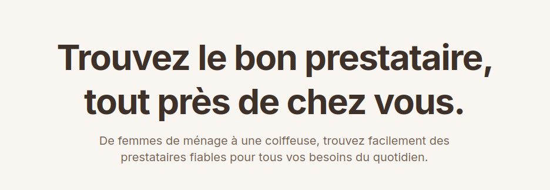
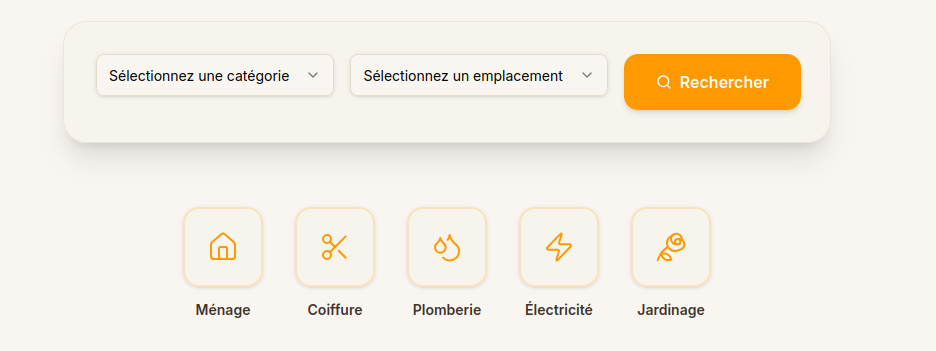
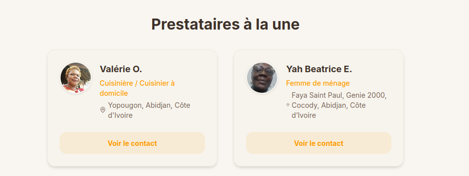
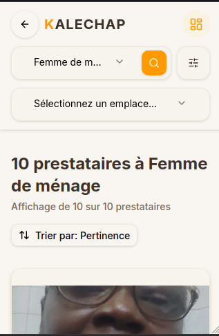

# Page d'accueil (Landing)

Découvrez ce que vous voyez et pouvez faire sur la page d'accueil de **kalechap.com**, avant même de créer un compte.

---

## 1. À quoi ressemble la page d'accueil ?

Lorsque vous arrivez sur [kalechap.com](https://kalechap.com), vous atterrissez sur la **page d'accueil publique**. Elle se compose de plusieurs sections :

### La barre de navigation

En haut de la page, vous trouvez le logo **KALECHAP** ainsi que des liens vers la recherche de services, la connexion et l'inscription.

### La section principale (Hero)

Un grand titre vous présente Kalechap : **"Trouvez le bon prestataire, près de chez vous."** avec une description rapide de la plateforme.

Juste en dessous se trouve une **barre de recherche** pour chercher un service sans avoir besoin de vous connecter :

- **Quel service ?** (ex : Plombier, Coiffeur, Femme de ménage)
- **Où ?** (ex : Cocody, Marcory, Yopougon)

### Les prestataires à la une

Une section présente des prestataires mis en avant, avec leur photo, leur nom, leur catégorie et un bouton **Voir le contact**.

### Comment ça marche ?

Trois étapes simples expliquent le fonctionnement :

1. **🔍 Recherchez** — Trouvez le service dont vous avez besoin
2. **🤝 Choisissez** — Parcourez les prestataires et comparez
3. **📞 Contactez** — Entrez en relation directement

### Vous êtes prestataire ?

Une section spécifique vous invite à **vous inscrire** pour proposer vos services.

### Catégories populaires

Des raccourcis cliquables vers les catégories les plus recherchées : Ménage, Coiffure, Plomberie, Électricité, Jardinage, etc.

---

## 2. Rechercher un service sans connexion (recherche publique)

Vous pouvez explorer les services disponibles **sans créer de compte**.

### Étapes

1. **Saisissez votre recherche**
   Dans la barre de recherche de la page d'accueil, entrez un service (ex: "Coiffeur") et un lieu (ex: "Cocody").

2. **Explorez les résultats**
   Vous arrivez sur la page **Explorer les services** qui affiche les résultats correspondant à vos critères.

   

3. **Filtrez et triez**
   Vous pouvez affiner les résultats :
   - **Par note minimum** : filtrez par étoiles (3+, 4+, etc.)
   - **Par prix** : moins de 10 000 FCFA, entre 10 000 et 25 000 FCFA, plus de 25 000 FCFA
   - **Par localisation** : commune ou quartier spécifique
   - **Trier par** : Pertinence, Prix croissant, Prix décroissant, Mieux notés

   

4. **Consultez les détails d'un service**
   Cliquez sur **Voir** ou **Voir les détails** sur une fiche de service pour accéder aux informations complètes : photos, description, prix, évaluations, et informations sur le prestataire.

5. **Demander le service** (nécessite une connexion)
   Pour envoyer une demande au prestataire, vous devez vous connecter ou créer un compte. Le bouton **Demander ce service** vous redirigera vers la page de connexion, puis vers le formulaire de demande.

---

## 3. Que faire si je ne trouve pas de résultats ?

- **Élargissez le rayon de recherche** — essayez de chercher dans un périmètre plus large
- **Modifiez les mots-clés** — utilisez des termes plus génériques
- **Changez de catégorie** — parcourez les catégories populaires pour trouver des services proches

> [!NOTE]
> La recherche publique vous permet de **découvrir** les prestataires, mais pour **envoyer une demande** ou **publier un service**, vous devrez créer un compte.

---

## 4. Actions suivantes

| Vous voulez... | Par où commencer |
|---|---|
| Créer un compte | [Inscription](inscription.md) |
| Vous inscrire en tant qu'agence | [Inscription Agence](inscription-agence.md) |
| Vous connecter | [Connexion](connexion.md) |
| Rechercher des services connecté | [Rechercher un service](rechercher-service.md) |

  <a href="../" class="page-nav-item page-nav-item--prev">
    ← Page précédente
    Accueil
  </a>
  <a href="../inscription/" class="page-nav-item page-nav-item--next">
    Page suivante →
    Inscription
  </a>

