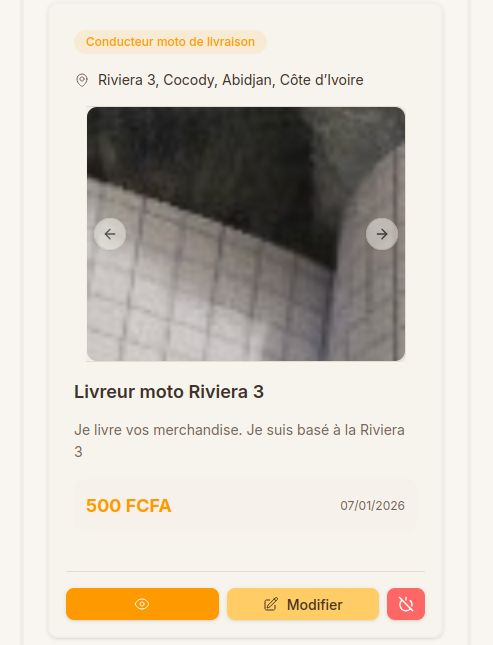
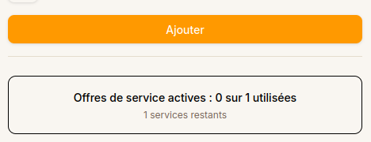

# Nombre d'offres de service

Chaque plan d'abonnement sur Kalechap limite le nombre d'offres de service que vous pouvez avoir **actives** simultanément.

---

### 1. Limite atteinte : Mettre à niveau

Si vous avez atteint le nombre maximum d'offres autorisé par votre plan, le bouton **Ajouter** sera désactivé et un bouton **Mettre le plan à niveau** apparaîtra juste en dessous.

En cliquant sur ce bouton, vous serez redirigé vers la page de [Souscription](subscription.md) pour choisir un plan supérieur.

---

### 2. Alternative : Désactiver un service

Si vous ne souhaitez pas changer de plan, vous pouvez libérer un emplacement en désactivant l'une de vos offres actuelles.

Repérez le bouton de désactivation (icône de "pause" ou "stop") sur la carte de votre service actif :

Cliquez sur le bouton pour désactiver le service :

---

### 3. Résultat : Bouton Ajouter disponible

Une fois qu'un emplacement est libéré, le compteur des services restants se met à jour et le bouton **Ajouter** redevient cliquable.

