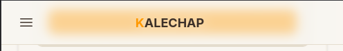

# Profil

Apprenez à gérer et à compléter votre profil sur Kalechap.

---

### 1. Ouvrir le menu

Appuyez sur le bouton de menu (hamburger) en haut à gauche de votre écran.

### 2. Accéder à l'espace Prestataire

Dans le menu latéral, vous verrez deux onglets : "Demandeur" et "Prestataire".

> [!IMPORTANT]
> Actuellement, seuls les utilisateurs ayant un [**abonnement actif**](subscription.md) peuvent accéder à l'onglet **Prestataire**. C'est dans cet onglet que se trouve le lien vers votre profil.
> _Note : À l'avenir, tous les utilisateurs inscrits pourront modifier leur profil._

### 3. Cliquer sur Profil

Une fois dans l'onglet Prestataire, cliquez sur le lien **Profil**.

### 4. Compléter votre profil

Vous arrivez sur la page de votre profil.

> [!NOTE]
> Lors de votre première visite, votre profil sera vide. Prenez le temps de le remplir avec soin ([photo](add-profile-picture.md), description, compétences, etc.) pour augmenter votre visibilité.

N'oubliez pas d'appuyer sur le bouton **Sauvegarder** une fois vos modifications terminées.

