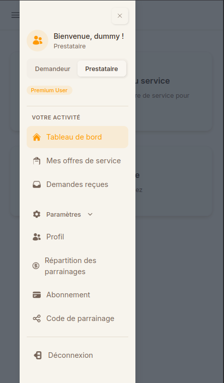
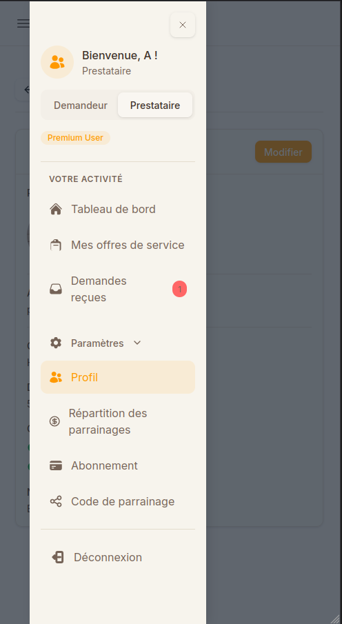
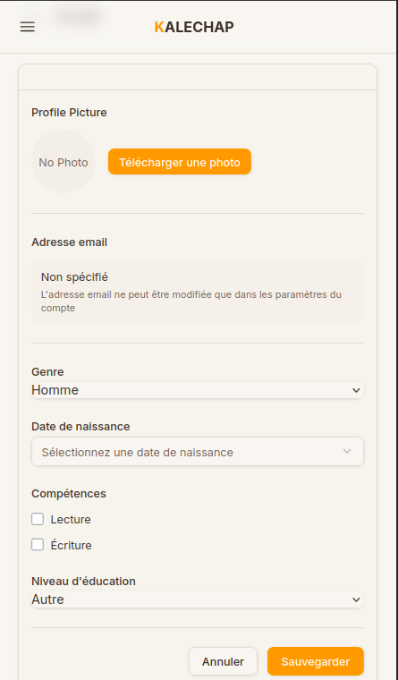

# Profil

Apprenez à gérer et à compléter votre profil sur Kalechap.

---

### 1. Ouvrir le menu

Appuyez sur le bouton de menu (hamburger) en haut à gauche de votre écran.

### 2. Accéder à l'espace Prestataire

Dans le menu latéral, vous verrez deux onglets : "Demandeur" et "Prestataire".

> [!IMPORTANT]
> L'onglet **Prestataire** est accessible à tous les utilisateurs disposant d'un [**abonnement actif**](subscription.md) (Gratuit, Standard, Pro ou VIP). C'est dans cet onglet que se trouve le lien vers votre profil.

### 3. Cliquer sur Profil

Une fois dans l'onglet Prestataire, cliquez sur le lien **Profil**.

### 4. Compléter votre profil

Vous arrivez sur la page de votre profil.

> [!NOTE]
> Lors de votre première visite, votre profil sera vide. Prenez le temps de le remplir avec soin ([photo](add-profile-picture.md), description, compétences, etc.) pour augmenter votre visibilité.

N'oubliez pas d'appuyer sur le bouton **Sauvegarder** une fois vos modifications terminées.

---

## 5. Profil d'agence

Si vous êtes inscrit en tant qu'[agence](inscription-agence.md), votre profil contient des champs supplémentaires :

- **Nom de l'agence** : affiché sur vos offres de service
- **Statut de vérification** : "Agence vérifiée" ou "Vérification en attente"
- Un badge **Agence** apparaît sur vos fiches de service

> [!TIP]
> Pour ajouter le nom de votre agence ou vérifier votre statut, allez dans les paramètres de votre profil et remplissez la section **Inscription en tant qu'agence**.

  <a href="../subscription/" class="page-nav-item page-nav-item--prev">
    ← Page précédente
    Souscription
  </a>
  <a href="../parametres-compte/" class="page-nav-item page-nav-item--next">
    Page suivante →
    Paramètres du compte
  </a>

