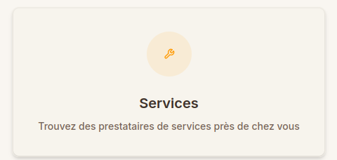
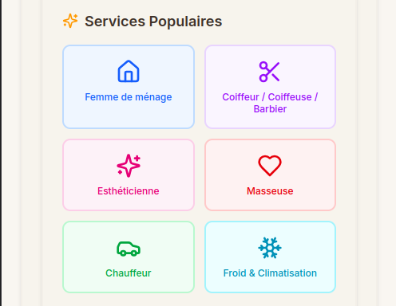
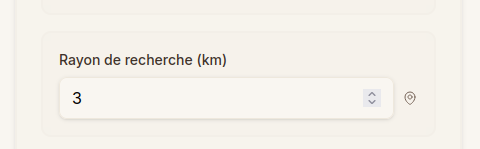

# Rechercher un service

Suivez ce guide pour trouver les services dont vous avez besoin sur Kalechap.

---

### 1. Accéder au Tableau de Bord

Une fois connecté, vous arrivez sur votre tableau de bord (Dashboard).

### 2. Ouvrir la recherche de services

Appuyez sur la carte ou le bouton **Services** pour commencer votre recherche.

### 3. Formulaire de recherche

Vous verrez l'écran **Trouvez des services**. C'est ici que vous définissez vos critères.

### 4. Choisir la catégorie

Vous devez choisir la catégorie de services que vous cherchez. Deux options s'offrent à vous :

- Sélectionner parmi les **catégories populaires**.

- Ou choisir une catégorie spécifique dans la liste déroulante en saisissant un terme de recherche.

### 5. Choisir le lieu

Indiquez le lieu ou le quartier où vous souhaitez trouver le service.

### 6. Définir le rayon de recherche

Vous pouvez ajuster le rayon de recherche. Par défaut, la recherche s'effectue dans un rayon de **3 km**.

### 7. Lancer la recherche

Enfin, appuyez sur le bouton **Rechercher** en bas du formulaire pour voir les résultats.

---

> [!TIP]
> N'hésitez pas à élargir le rayon de recherche si vous ne trouvez pas de prestataires immédiatement à proximité.

  <a href="../profil/" class="page-nav-item page-nav-item--prev">
    ← Page précédente
    Profil
  </a>
  <a href="../service-request/" class="page-nav-item page-nav-item--next">
    Page suivante →
    Demander un service
  </a>

