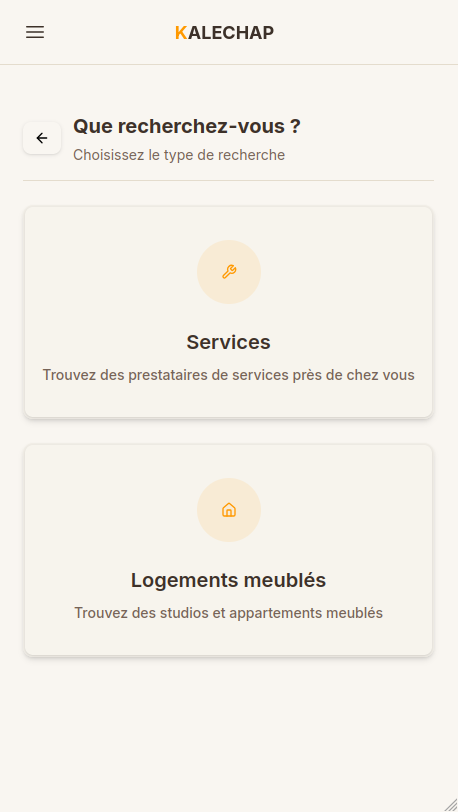
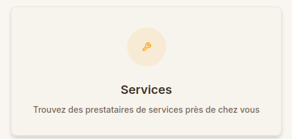
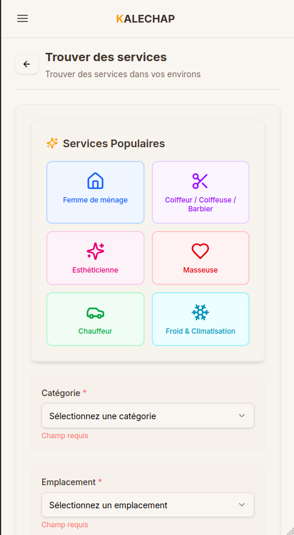
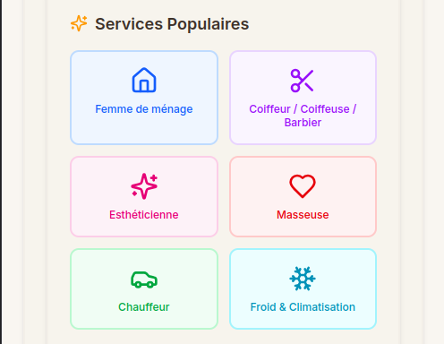
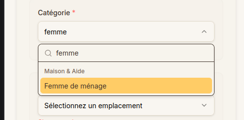
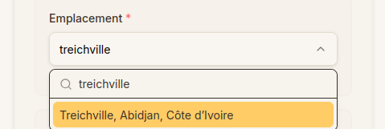
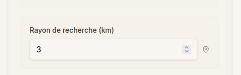
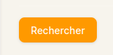
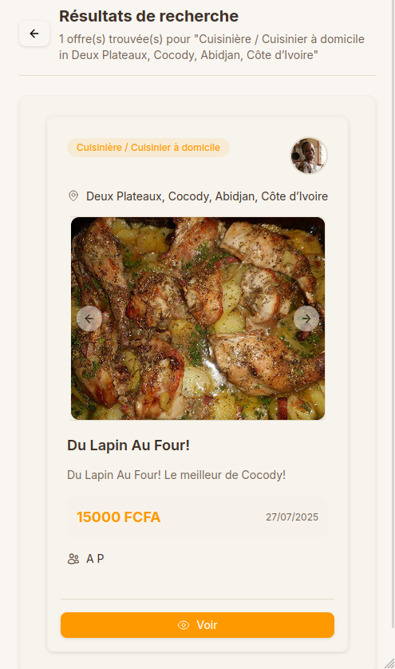
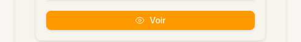

# Rechercher un service

Suivez ce guide pour trouver les services dont vous avez besoin sur Kalechap.

---

### 1. Accéder au Tableau de Bord

Une fois connecté, vous arrivez sur votre tableau de bord (Dashboard).

### 2. Ouvrir la recherche de services

Appuyez sur la carte ou le bouton **Services** pour commencer votre recherche.

### 3. Formulaire de recherche

Vous verrez l'écran **Trouvez des services**. C'est ici que vous définissez vos critères.

### 4. Choisir la catégorie

Vous devez choisir la catégorie de services que vous cherchez. Deux options s'offrent à vous :

- Sélectionner parmi les **catégories populaires**.

- Ou choisir une catégorie spécifique dans la liste déroulante en saisissant un terme de recherche.

### 5. Choisir le lieu

Indiquez le lieu ou le quartier où vous souhaitez trouver le service.

### 6. Définir le rayon de recherche

Vous pouvez ajuster le rayon de recherche. Par défaut, la recherche s'effectue dans un rayon de **3 km**.

### 7. Lancer la recherche

Enfin, appuyez sur le bouton **Rechercher** en bas du formulaire pour voir les résultats.

---

### 8. Après la recherche : la liste des résultats

Une fois la recherche effectuée, vous voyez la liste des services disponibles correspondant à vos critères.

Chaque fiche de résultat affiche :

- Le **nom du prestataire**
- La **catégorie** du service
- Le **prix**
- La **note moyenne** (étoiles) et le nombre d'évaluations
- La **localisation**

### 9. Filtrer et trier les résultats

Vous pouvez affiner les résultats avec les options de filtre :

| Filtre | Description |
|---|---|
| **Note minimum** | Afficher uniquement les services avec une note de 3, 4 ou 5 étoiles |
| **Prix** | Filtrer par tranche de prix (ex : moins de 10 000 FCFA) |
| **Localisation** | Limiter à une commune ou un quartier spécifique |
| **Trier par** | Pertinence, Prix croissant, Prix décroissant, Mieux notés |

### 10. Si aucun résultat n'est trouvé

Si votre recherche ne donne aucun résultat, essayez de :

- **Élargir le rayon de recherche** (passez de 3 km à 5 km, 10 km ou plus)
- **Changer de catégorie** ou utiliser un mot-clé plus générique
- **Vérifier l'orthographe** du lieu ou du service saisi

> [!TIP]
> Plus le rayon est grand, plus vous aurez de résultats. N'hésitez pas à l'augmenter progressivement.

### 11. Voir les détails d'un service

Pour obtenir plus d'informations sur un service, appuyez sur le bouton **Voir** sur la fiche du service. Vous accéderez à la page de détail avec les photos, la description complète, le prix et les évaluations.

---

> [!TIP]
> N'hésitez pas à élargir le rayon de recherche si vous ne trouvez pas de prestataires immédiatement à proximité.

  <a href="../parametres-compte/" class="page-nav-item page-nav-item--prev">
    ← Page précédente
    Paramètres du compte
  </a>
  <a href="../service-request/" class="page-nav-item page-nav-item--next">
    Page suivante →
    Demander un service
  </a>

