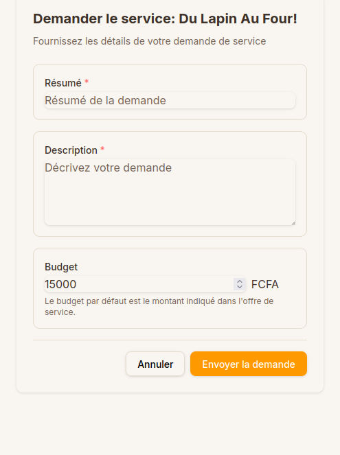

# Demander un service

Une fois que vous avez trouvé un service qui vous intéresse (voir [Rechercher un service](rechercher-service.md)), suivez ces étapes pour envoyer une demande au prestataire.

---

### 1. Consulter les résultats de recherche

Après avoir effectué une recherche, vous verrez l'écran **Résultats de recherche**.

### 2. Voir les détails du service

Pour obtenir plus d'informations sur un service, appuyez sur le bouton **Voir** en bas de la fiche du service.

### 3. Examiner les détails

Vous accédez alors aux détails complets du service : photos, description détaillée, prix et informations sur le prestataire.

### 4. Contacter le prestataire

Grâce aux informations fournies, vous pouvez contacter le prestataire directement si vous le souhaitez.

### 5. Demander le service

Pour envoyer une demande formelle au prestataire, appuyez sur le bouton **Demander le service**.

### 6. Remplir le formulaire de demande

Le formulaire de demande s'ouvre. Complétez les champs suivants :

- **Résumé de votre demande** : Un titre court pour votre besoin.
- **Description** : Plus de détails sur ce que vous attendez.
- **Votre budget** : Par défaut, le prix affiché sur le service est proposé, mais vous pouvez le modifier selon votre budget.

### 7. Envoyer la demande

Enfin, appuyez sur le bouton **Envoyer la demande** pour transmettre votre note au prestataire.

