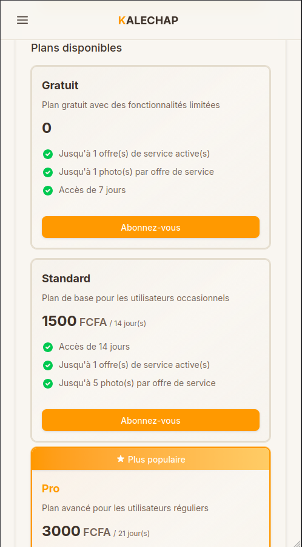

# Souscription

Apprenez à souscrire à un plan Kalechap pour profiter de plus de fonctionnalités.

---

### 1. Ouvrir le menu

En haut à gauche de l’écran, appuyez sur le bouton de menu (icône "hamburger").

### 2. Accéder aux abonnements

Une fois le menu latéral ouvert, cliquez sur le lien **Abonnement**.

### 3. Choisir un plan

Vous verrez alors l'écran affichant les différents plans disponibles (Gratuit, Standard, Pro, VIP).

### 4. Souscrire

Cliquez sur le bouton **Abonnez-vous** du plan qui vous intéresse pour finaliser votre souscription.

### 5. Validation du paiement (Plans payants)

Si vous choisissez un plan payant (Standard, Pro, VIP), une fenêtre de paiement s'affichera.

Procedez à la validation de la transaction **Wave** sur votre téléphone.

  <a href="../connexion/" class="page-nav-item page-nav-item--prev">
    ← Page précédente
    Connexion
  </a>
  <a href="../profil/" class="page-nav-item page-nav-item--next">
    Page suivante →
    Profil
  </a>

